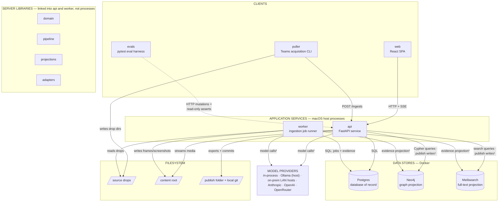
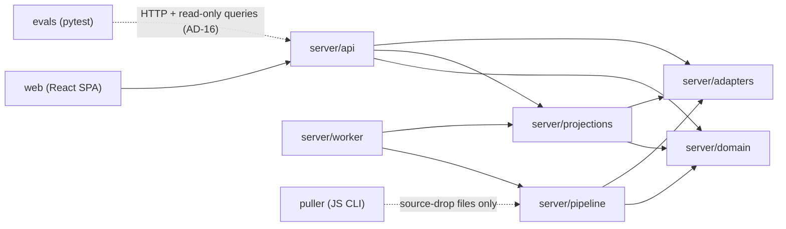
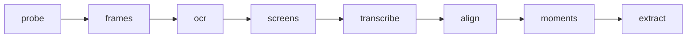
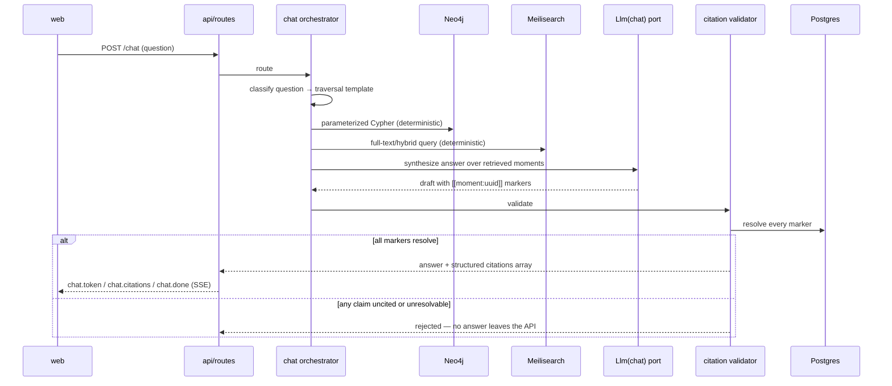
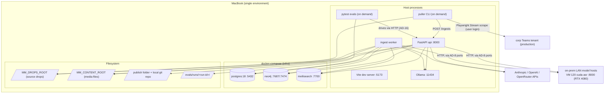
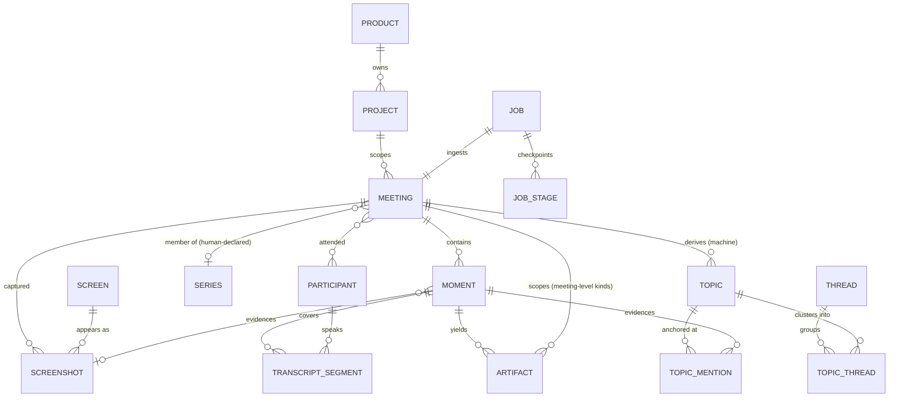

# Architecture Spine — meetingminer

## Component Design

Paradigm in one line: **deterministic evidence pipeline at the core; ports-and-adapters at every non-deterministic or external boundary; CQRS-lite storage** — Postgres is the single write model, Neo4j and Meilisearch are derived read projections, and model outputs are confined to three writable surfaces: extracted artifacts (human-approved before publication, AD-4), answer prose that must pass citation validation (AD-15), and machine-derived navigation metadata — topics and threads — which is labelled as such, is never citable, and never enters the artifact lifecycle (AD-5). Evidence records are written by deterministic code only.

### Component diagram (HLD)

One node per component. Edges are runtime interfaces, labeled with their protocol. Internal structure lives in the responsibilities table, the module-structure diagram, and the pipeline-stage diagram below — never in this view.



¹ All store writes execute inside the `projections` library — the publish gate and rebuild live there (AD-4). ² All model calls execute through `adapters` ports bound in `config.yaml` (AD-8).

### Component responsibilities

| Component | Owns | Exposes | Consumes |
| --- | --- | --- | --- |
| `web` | All UI; replay via HTML5 video at `startMs` | — | Generated TS client, SSE events |
| `api/routes` | REST surface, OpenAPI schema | `/ingests` `/jobs` `/meetings` `/moments` `/search` `/chat` `/artifacts` `/participants` `/media` | domain, projections (queries), adapters |
| `api/chat orchestrator` | Question routing to traversal templates; answer assembly | `/chat` (SSE stream) | Neo4j Cypher templates, Meilisearch queries, `Llm(chat)` port |
| `api/citation validator` | AD-15 gate: marker resolution, structured citations array | — (in-path) | Postgres moment rows |
| `api/approval+publish` | Artifact lifecycle column, folder export, local git commits | approve/publish endpoints | Postgres, projections (publish trigger) |
| `worker` | Job claiming, stage sequencing, checkpoints, retries | job progress rows (read by API) | pipeline, projections (ingest-complete trigger) |
| `pipeline` stages | Evidence computation: frames, OCR text, screen identity, transcript merge, moments, extraction (artifacts **and** topics) | stage functions (called only by worker and evals-via-API) | adapters, domain, content root |
| `projections` | ALL Neo4j/Meilisearch writes; publish gate; embeddings; `rebuild` | projector API (worker, approval service), `rebuild` CLI | domain, `Embedder` port, Postgres (read) |
| `adapters` | Port interfaces + engine implementations | `Ocr` `Stt` `Diarizer` `Llm(role)` `Embedder` | `config.yaml` bindings only |
| `domain` | Entity definitions, invariant logic, UUIDv7 minting | pure functions/models | nothing above it |
| `puller` | Teams acquisition from the corp tenant (Playwright Stream scrape, user login), drop assembly via its emit-drop step | source-drop directories | its persisted browser session (`.transcript-profile/`); no server code |
| acquisition commands | Non-Teams sources: YouTube video/playlist, local recordings and files with transcript dialect conversion; all mint conforming drops | source-drop directories, `/acquisitions` routes | `transcripts/dialects.py`, `config.yaml` refusal boundaries |
| `digest` | Morning Digest example generator: reads published artifacts, renders one example file | CLI | Postgres (read-only) |
| `prune` | Corpus removal — deletes every meeting outside an explicit keep-set; reports by default, deletes only under `--delete` | CLI | Postgres, content root |
| `evals` | Ground-truth fixtures, tiered checks, run artifacts | `evals/runs/<run-id>/` | public API + read-only store queries |

### Server module structure

Module-level view of the two services' shared libraries. An arrow means "may depend on"; anything not drawn is forbidden:



`domain` depends on nothing above it. `adapters` never import `domain`. `puller` shares no code with the server — its only contracts are the source-drop format (AD-1) and the public `POST /ingests` call (AD-14).

### Ingest pipeline stages

Execution order inside the `pipeline` library, run by the worker with a checkpoint after each stage (AD-11):



`probe`: ffprobe media inspection · `frames`: ffmpeg sampling · `ocr`: text per frame (`Ocr` port) · `screens`: screen identity via OCR-text similarity · `transcribe`: STT verification lane (`Stt` port) · `align`: merge provided + STT transcripts (AD-13) · `moments`: screen–discussion alignment · `extract`: ADRs + action items, plus per-meeting topics anchored to the moments where they were discussed (`Llm(extraction)` port, visible prompts). Threads are derived corpus-wide from stored topics, outside the per-meeting stage sequence.

Transcript-only drops (no recording, AD-1): `probe → frames → ocr → screens → transcribe` skip; `moments` falls back to transcript segmentation, so moments carry no screenshot (the ERD and AD-15's `screenshotId` already make it optional) and video replay is unavailable; `extract` runs normally.

### Cited Q&A flow (primary query path)



## Invariants & Rules

### AD-1 — One canonical inbox: the source drop

- **Binds:** CAP-1, puller, pipeline
- **Prevents:** per-source ingestion paths that diverge; ingestion coupling to Teams/Graph
- **Rule:** Every source — Teams puller, local recording, YouTube video or playlist — lands as a *source drop*: one **write-once** directory containing the recording when the source has one, an optional transcript (VTT and/or the puller's speaker-attributed `[m:ss] Speaker: text` export), and `metadata.json`. At least one of recording or transcript must be present — transcript-only drops are first-class (most of the real pulled corpus has view-only recordings with no downloadable video); their pipeline behavior is defined under *Ingest pipeline stages*. The drop contract is pinned by a versioned JSON Schema at `docs/source-drop.schema.json` (camelCase fields, explicit `schemaVersion`) — the drop-directory schema is this architecture's decision, not the puller's output layout; the puller's emit-drop step maps its native `<Title>/<M.D.YY>/` output into it, assembling in a staging path and finalizing atomically, and a re-pull never overwrites a finalized drop. Puller and pipeline both validate against the schema in their tests. `metadata.json` requires: `sourceId` — the occurrence's stable identity the puller already holds (recording drive-item ID or Stream URL); `corpus` (`"scripted"` | `"real"`), carried onto the Meeting row; `startedAt` — full ISO 8601 UTC, derived by emit-drop from the recording-filename timestamp when present, else the meeting date at 00:00 UTC — with `startedAtPrecision` (`"second"` | `"day"`); the pipeline never re-derives wall-clock from media metadata; and `provenance` — the puller's `_source.json` content embedded (copying the original file alongside is permitted and ignored). Files in a drop directory not named by the schema are ignored at intake (the existing puller's generated summaries fall here). A drop's canonical files must be **regular files holding the bytes**: intake refuses a drop whose `recording.mp4`, `transcript.vtt`, `transcript.txt` or `metadata.json` is a symlink, and refuses a drop directory that is itself one. A symlink puts the evidence outside the write-once drop, where anything may rewrite or delete it — which makes write-once unenforceable, makes AD-17's `sha256` and `byte_size` describe bytes that can change without the row changing, and means backing up the drops root does not back up the evidence. The refusal belongs at the door, because a symlinked recording currently passes intake (`domain/drops.py` tests `is_file()`, which follows links) and reports the meeting as having a recording, then fails replay with a 404 — a meeting claiming replay evidence it cannot serve. A **hard link is not a symlink** and is not refused: it names the same bytes from inside the drop, so the drop does contain them. Ingestion consumes only drops and never knows the source; the puller emits only drops and never knows the pipeline. Participant resolution is the **source side's** job — the sidecar carries whatever participants the puller can supply (best-effort); when a drop omits them, the pipeline derives participants from transcript speaker attribution, and humans edit via the API (AD-5). The Teams puller supplies them by mapping its per-occurrence participant graph (`<stem> org chart.json`, written from the SharePoint user-profile service) into `participants`, renaming the chart's `name` to `displayName` and passing every other field through verbatim; the key is omitted rather than emitted empty when no usable chart exists, because an empty array asserts that the source looked and found nobody and suppresses the transcript-label fallback. No server component calls Microsoft Graph; Graph participant lookup is product-later. The schema declares `schemaVersion` as `enum: [1, 2]` and describes both versions. Version 2 adds one optional field, `augments` (an object requiring `sourceId`, closed to other keys): a drop carrying it declares the already-ingested occurrence it augments rather than opening a new one, which is how evidence that reached the occurrence after its ingest gets in — a recording recovered after a transcript-only ingest (story 1.12), or the participant graph for a meeting whose drop was emitted without one (story 1.13); the intake behaviour is AD-14. `augments` implies version 2, so a consumer pinned to version 1 fails on such a drop instead of ignoring the field and ingesting the recording as a second meeting; version 1 drops carrying no `augments` validate unchanged. The declaration, not the drop's own `sourceId`, is the link, so the two ids may differ — a recording recovered from the recorder's personal drive legitimately carries its own drive-item id. The puller emits augmenting drops only under its opt-in `--re-emit` flag (story 1.13): an ordinary re-pull resolves to the same finalized drop directory and is reported as `exists`, while `--re-emit` writes a *new sibling* drop at `<name>-002`, `-003`, … carrying `schemaVersion: 2` and `augments` — but only when the pass would bring the newest existing drop for that occurrence something it lacks (a participant graph, or a canonical evidence file), which is the same test intake applies, so the puller never finalizes a write-once drop the door will refuse. The finalized drop is never renamed, rewritten or deleted, so sequence 1 is the existing unsuffixed name; the three-digit sequence keeps emit order recoverable from the drops folder by lexical sort within an occurrence's prefix, and a repeat pass that finds nothing new writes nothing.

### AD-2 — Postgres is the sole database of record [ADOPTED]

- **Binds:** all
- **Prevents:** two owners of one entity; projections drifting into primary copies
- **Rule:** Every domain object and artifact is minted as a Postgres row first; its ID is created there and nowhere else. No component treats Neo4j, Meilisearch, or the filesystem as authoritative for domain state — Postgres is the sole authoritative store. The domain graph is relational (FK edges), traversable by SQL alone.

### AD-3 — Binaries on disk, paths in the DB, relative to one of two roots

- **Binds:** CAP-1, CAP-4, pipeline, api
- **Prevents:** blobs in databases; absolute paths breaking relocation and replay; a reader concluding that arriving material must be copied under the content root
- **Rule:** There are two configured, permanent storage roots — the **drops root** (`MM_DROPS_ROOT`) and the **content root** (`MM_CONTENT_ROOT`) — and every recorded path is relative to exactly one of them. Which one is a property of how the file came to exist, not of its type. Material that **arrived** (the recording, provided transcripts, `metadata.json`) stays in its write-once drop (AD-1) and is recorded as `<drop-dir>/<filename>` against the drops root. Material this pipeline **produced** (frames, screenshots, extracted audio) is written as `meetings/<meeting_id>/<subdir>/<filename>` against the content root, keyed by the Postgres-minted meeting id so it survives a re-emit that changes the drop directory. The recording is arriving material and is **not** copied under the content root: AD-1 already makes its drop permanent, so a copy would be a second permanent copy of permanent material, and it would fix replay while leaving transcript re-parse and the augmentation door still resolving through the drop. Neither root's absolute location is stored in a database or leaves the server — the API and the worker resolve a stored path against its configured root at use time, so relocating either root is an environment change, not a data migration. Both roots are backed up together: the drops root is not a clearable landing zone, because ingested drops are re-read for transcript re-parse, for replay, and for the augmentation comparison long after ingest. Full layout, per-file anchors, and the bring-your-own-recording path: `storage-layout.md`. The publish folder is a third configured location and deliberately **not** a third root: this rule governs evidence, and a published artifact is an *export* — written once by the API into a git working tree, read by humans and by git, never resolved from a stored path when serving a request. No row records a path relative to it. This rule governs material the system **serves but does not retrieve over**. Where content must be **searchable, it is a Postgres row, not a file**: the search and graph projections are built from Postgres and `config.yaml` alone (AD-4) and never open an evidence file, so text that exists only in a drop cannot be indexed and would fall out of search on every rebuild. That is the actual line between the two cases, and it is why the recording stays in its drop — nothing retrieves over the mp4 bytes, while everything searchable derived from it (transcript segments, OCR text) is already materialized as rows. It is also why an extraction document's text is a column for **both** origins: a document that arrived in a drop is still content the corpus must retrieve over, and a second copy of a few kilobytes is what makes it indexable at all. Do not read the recording precedent as a general rule against copying arrived material into Postgres; read it as a rule about material nothing searches. Story 2.1a closed the last gaps between this rule and the code: migration `0008_drop_root_anchored_paths` CHECKs that no stored path is absolute or carries a `..` segment, and `make backfill-drop-paths` anchors rows written before it.

### AD-4 — Projections have exactly one writer

- **Binds:** CAP-2, CAP-9, worker, api
- **Prevents:** clashing Neo4j/Meilisearch document shapes from independent writers; drafts leaking into retrieval
- **Rule:** All writes to Neo4j and Meilisearch go through `server/projections` — invoked by the worker at ingest-complete and by the API at publish. **Evidence objects** (meetings, moments, screens, transcripts) project at ingest-complete; **artifacts** project only on publish. Machine-derived navigation metadata is a **third case and sits outside the publish gate**: `Topic` nodes project with their meeting's evidence and are never put through the publishable check, since topics carry no lifecycle state to check. `Thread` nodes are upserted like `Screen` — a thread exists precisely because it spans meetings, so a per-meeting pass never deletes one — and because extraction and thread derivation are two passes, a meeting whose topics have not yet been threaded projects `Topic` nodes and no `Thread`, which is a valid intermediate state rather than a fault. The artifact lifecycle is **one-way** (`extracted → approved → published`); no unpublish exists in the capstone. The publish gate lives *inside* this module: it refuses any artifact whose Postgres state is not `published`. Consequently search and chat operate over evidence plus published artifacts only; unpublished artifacts are visible solely in the moment view's right rail via API reads of Postgres. The projection module computes embeddings itself through the `Embedder` port; store-native auto-embedders stay disabled — so `rebuild`, a CLI that regenerates both stores from Postgres + `config.yaml` alone, stays deterministic. Any migration or corruption is answered by rebuild, never by hand-editing a store. `rebuild` **reads** Postgres and writes only the two stores — it never writes primary data, which is what makes it safe to run at any time against the record it rebuilds from. A derivation that mints primary rows is therefore never folded into it: thread derivation reads stored topics and writes `thread`/`topic_thread` rows, so it is its own command. That fixes an order — **ingest, then derive, then rebuild** — because a topic's `thread_id` is null until derivation has run and the projection carries whatever it reads at the time; a rebuild run first bakes the nulls in and reports success. Because nothing in a unit test can catch a derivation the shipped package never calls, the caller is pinned structurally: a test walks the package's ASTs and asserts the derivation has a caller outside the test suite. An augmenting re-run (AD-14) **invalidates** the meeting's projection state rather than unprojecting it, deliberately: the meeting stays answerable from its existing transcript in both stores for the length of the re-run instead of disappearing from search and chat. The documented cost is a concurrent `rebuild` re-inserting the projection state row and restoring it to no-action, after which the augmented bundle never projects; the remedy is `rebuild --meeting`.

### AD-5 — Table ownership is disjoint

- **Binds:** worker, api
- **Prevents:** two processes mutating the same rows; lost updates without locking machinery
- **Rule:** The worker writes evidence tables (meetings, screens, screenshots, moments, transcripts) and job tables. The API writes user-declared data (series membership, project/product assignment). Two tables are **split by column**: *artifacts* — worker inserts rows and owns extraction content; API owns the lifecycle column (`extracted → approved → published`) and publish metadata. *Participants* — worker inserts rows during intake (from drop metadata or transcript speaker attribution), deduplicating by the **mail address** the drop's participant graph supplies when it has one (case-folded, namespaced `mail:`), else by **normalized display name** (namespaced `name:`): case-folded, parenthetical qualifiers stripped (`(CNTR)`, `(Foster, Logan)`-style wrappers), and `Last, First` reordered to `First Last`. The participant graph is resolved from the SharePoint user-profile service; Microsoft Graph and AAD object IDs are an explicit non-goal of the drop contract, so no identity key ever carries one. API owns human-curated columns (display-name edits, merges). The API also solely owns `app_setting`, the key/value table holding the user's model selections (AD-10); the worker reads it to resolve a role and never writes it.
  Two further groups are **worker-owned and machine-derived**, and every reader must label them as such: `topic`/`topic_mention` (migration `0014`) and `thread`/`topic_thread` (migration `0015`). These are navigation metadata, **not artifacts** — they never enter the `extracted → approved → published` lifecycle and never get an `artifact` row. Their rerun disciplines deliberately differ: a meeting's topics are replaced wholesale on every extraction rerun, while thread derivation must be **idempotent** — a rerun over unchanged topics yields the same threads, ids included, because the graph projection, thread curation and the timeline all key on `thread.id` — so a thread is identified by a content-derived `identity_key` and derivation reuses an existing row before minting. Human thread curation (merge, split, rename) arrives as separate API-owned rows on top, the same split this rule already makes for participants. A merge writes an API-owned **alias row** (`alias_key → surviving participant id`); the worker resolves its identity key through the alias table before any insert, so merges survive re-ingests and stage reruns. Outside these splits, neither process writes the other's tables; shared access is read-only.

### AD-6 — Citations are Postgres-minted moment IDs, gated in code

- **Binds:** CAP-3, CAP-4, CAP-9
- **Prevents:** citations that resolve in one store but not another; uncited LLM claims reaching the user
- **Rule:** A moment's ID is minted once (AD-2) and carried verbatim into Neo4j nodes, Meilisearch documents, and every answer. The chat path is: deterministic router → traversal/search → LLM synthesis → **deterministic citation validator** that rejects any answer whose factual claims lack resolvable moment IDs. "No citation, no answer" is enforced by this validator, not by prompt instructions.
  An **artifact may be scoped to a meeting rather than to a moment** — a meeting summary analyses the whole transcript and has no single moment to hang from — and that scope is a property of its `kind`, declared in exactly one place so that no reader re-derives the mapping with a list of its own. What does **not** widen is the citation contract. `meeting_id` is an artifact's scope and provenance, never a citation: a citation is a moment, because AD-15's array carries `startMs`/`endMs` and the promise is that a citation opens the recording at the second. Admitting an entry with no moment would hand every consumer — the web app's replay links, the eval checks, search — a citation that cannot replay, which is the silent degradation AD-18 forbids. A meeting-scoped artifact is therefore readable in its meeting's panel, and citable in an answer only through the moments its individual claims anchor to; a claim the document does not anchor is not citable, which is the rule every other claim already obeys. Widening an artifact's scope must also not weaken its anchor: where a moment is named, the composite edge pinning it to that moment's own meeting still holds, so no artifact can name a moment from a different meeting.

### AD-7 — GraphRAG is deterministic traversal templates

- **Binds:** CAP-2, CAP-3
- **Prevents:** a framework auto-extracting and owning a parallel graph; untestable retrieval
- **Rule:** Retrieval over the graph uses hand-written, parameterized Cypher templates against the Neo4j projection (neo4j-graphrag retriever classes optional as thin helpers). The LLM's only roles are classifying the question to a template and synthesizing the cited answer. No library builds, extracts, or owns graph structure.

### AD-8 — All model calls go through configured ports [ADOPTED]

- **Binds:** all AI touchpoints
- **Prevents:** provider SDKs imported in feature code; unswappable models
- **Rule:** Feature code calls project-owned port interfaces: `Ocr` (AppleVision | Tesseract), `Stt` (mlx-whisper | parakeet-mlx), `Diarizer` (noop | pyannote | remote-http), `Llm` (per role: extraction, chat, judge — via LiteLLM), `Embedder` (fixed 1024-dim vector space). Every binding comes from config (AD-10). Swapping a model is a config edit, never a code change — except the embedder: its model + dimension are part of projection state, so changing them forces a full projection rebuild (AD-4) and triggers the eval rerun rule.

### AD-9 — Runtime split: infra in Docker, code on host, inference wherever it is configured

- **Binds:** deployment, worker, api, adapters
- **Prevents:** workers landing in containers that cannot reach Apple Vision / MLX / Metal; a LAN model host being mistaken for cloud egress, or for an architecture change rather than a config change
- **Rule:** docker-compose runs only stateful infrastructure (Postgres, Neo4j, Meilisearch) — **one stack per checkout**, not one globally: `make worktree` provisions compose project `meetingminer-<slug>` on its own allocated ports and records the stack name, ports and an incarnation id in the worktree's gitignored `.env.worktree` (AD-10), so suites in different worktrees never contend. A stack belongs to this worktree only when every container and volume carries the matching incarnation label; anything else under that name is a stale incarnation and is torn down before compose runs. The Python API, worker, and React dev server run as macOS host processes. No pipeline stage may assume it runs in a container; no container may require macOS frameworks. Local-first is scoped to **evidence and state**: both storage roots (AD-3), the database of record (AD-2), and the retrieval projections (AD-4) live on the dev/demo MacBook and nothing moves them. It does **not** govern model inference. An engine may run in-process, as a host process (Ollama), on an **on-prem LAN host** reached over HTTP, or behind a provider API. Choosing among the *implemented* engines, and pointing one at a different endpoint, is a `config.yaml` binding (AD-10) resolved through the AD-8 ports. Standing up an engine that is not yet implemented is a new adapter behind an existing port — no pipeline stage, no feature code, and nothing in this spine changes for it. That is the whole claim: a remote engine is an adapter, not an architecture change. It has since been paid out — and not where this rule first guessed. The first remote engine landed on **`Diarizer`**, not `Stt`: `remote-http` posts one multipart upload to `POST /diarize` on a LAN GPU host named by `diarizer.base_url`, using the standard library rather than adding a third HTTP stack. No pipeline stage, no feature code and nothing else in this spine moved for it, which is the claim holding. It remains not the claim that every engine is reachable by editing config today: the `Llm`, `Embedder` and `Diarizer` bindings carry a `base_url`, while the `Stt` binding still names an engine and model with no endpoint, so the first remote ASR engine adds an endpoint to that binding as part of its adapter.

### AD-10 — One config file drives everything

- **Binds:** all
- **Prevents:** adapter bindings scattered across env vars, code defaults, and CLI flags
- **Rule:** A single versioned `config.yaml` declares every adapter binding (OCR/STT/diarizer engines, LLM per role, embedding model + dimension, provider endpoints) and every threshold — sampling intervals, similarity and lineage thresholds, chunk size, moment gap and duration caps, and refusal boundaries such as `acquisition.youtube.max_duration_minutes`. A threshold that exists only as a Python constant is not one anybody can turn, and the loader refuses a config that omits a required one rather than supplying a code default.
  The file declares what is **allowed**; it does not declare what a person **picked**. For each LLM role it carries a `catalog[]` of bindings that role may be served by plus a `default` among them, and the user's selection from that catalog is user-declared data living in the api-owned `app_setting` table (AD-5) — written only by `api/settings.py`, read by api and worker when they resolve a role. The key spelling (`llm.role.<role>.binding`) is owned by one module, `domain/model_selection.py`, and both readers go through it — the table is deliberately a generic key/value store, so no schema constraint can tell a valid key from a typo and the single owning module is what stands in for one. A selection is data, not configuration: it must survive a restart without anyone editing a tracked file, and it is re-checked against the catalog on read because the file can be edited after a row is written. Nothing outside the catalog can be selected.
  Environment variables carry what is machine-specific and untracked, and nothing else: secrets, the two storage root locations (AD-3), and — since the per-worktree stacks of AD-9 — the checkout's compose-stack name, its generated incarnation id (`MM_STACK_ID`), and the host ports its stores publish. Those ports are infrastructure *location*, applied by the loader to the configured endpoints rather than written into a second config file. The eval harness snapshots the full resolved config, file values and persisted selections alike, into each run's metadata, so any run is reproducible. Default bindings: extraction + chat = `claude-sonnet-5` (cloud primary), Ollama models as configured fallback; judge = bake-off winner per `eval-design.md`.

### AD-11 — Jobs are Postgres rows advanced by the host worker

- **Binds:** CAP-1, api, worker, web
- **Prevents:** pipeline work inside the API process; a broker dependency; unrestartable ingests
- **Rule:** The API enqueues work by inserting a job row; the worker claims it and advances named stages, checkpointing each in the DB. Every stage is idempotent — rerunning it deterministically overwrites its own outputs, where "its own" means rows keyed to that job's meeting only: cross-meeting entities (screens, participants) are upserted by identity key and never deleted by a rerun. UI progress is served by the API reading job rows (SSE); the API never executes pipeline stages in-process.

### AD-12 — Egress is unrestricted system-wide; the judge rule stays eval-scoped [ADOPTED]

- **Binds:** adapters, eval harness
- **Prevents:** building an unwanted allowlist enforcement layer; silently widening the eval judge rule
- **Rule:** Any configured provider may receive any content — no system-wide egress filter exists. The narrower rule in `eval-design.md` (cloud judges receive derived data only) remains in force for the judge role until changed there. Where `eval-design.md` says "endpoint allowlist," that resolves to the provider endpoints declared in `config.yaml` (AD-10) — no separate allowlist component exists or may be built.

### AD-13 — Provided transcripts are immutable inputs; merge, never erase

- **Binds:** CAP-1, pipeline
- **Prevents:** the STT verification lane clobbering a provided transcript; idempotent-stage reruns (AD-11) erasing source material
- **Rule:** Source-drop contents are read-only after intake. A provided transcript (Teams recap VTT or user-supplied file) is preserved verbatim; verification and alignment write *new* derived transcript rows carrying provenance to both the original and the STT output. AD-11's "overwrites its own outputs" applies to derived rows only — never to drop contents. When a drop carries multiple transcript forms, precedence is fixed: speaker labels come from the speaker-attributed export; cue timing comes from the VTT when present; `align` reconciles them (and the STT lane) by text alignment — never by picking one file wholesale. When no transcript is provided and the diarizer is the noop default, STT segments carry an `Unknown` speaker placeholder, editable via the API (AD-5). Moment identity rests on a consequence of this rule. **Where the drop provided a transcript**, its cue timing owns `transcript_segment.start_ms` and the STT lane writes its matched start and signed offset into the separate nullable `stt_start_ms` / `alignment_delta_ms` columns — never over `start_ms`. That is what holds a moment's `transcript:<start_ms>` identity key fixed when a recording arrives later (AD-14), and therefore what keeps every citation minted before the augmentation resolving after it. A capture or segmentation retune that writes STT timing into `start_ms` breaks every pre-existing citation, silently. **Where the drop provided no transcript**, the STT segments *are* the base and identity is STT-derived from the first run, so the same protection does not exist — which is why AD-14 admits a later drop that brings a recording or a participant graph and **not** one that brings a transcript to a meeting that had none: introducing a provided transcript would re-base every `start_ms` and move every citation the meeting has already minted.

### AD-14 — One intake door

- **Binds:** CAP-1, api, worker, web
- **Prevents:** each component inventing its own intake handshake; a second entry point (folder watcher) bypassing job tracking
- **Rule:** The only way evidence enters the system is `POST /ingests` with a drop path: the API validates the drop against the schema (AD-1) and inserts the job row; the worker mints the Meeting row at its first stage (AD-5) and links it to the job. A `POST /ingests` whose `sourceId` already has a non-failed job is rejected with an RFC 9457 conflict — re-processing an occurrence is a rerun of its existing job (AD-11), never a second Meeting row. The one exception is a drop declaring `augments` (AD-1): intake resolves the occurrence it names, refuses it unless that occurrence exists, has settled its evidence stages, and the new drop **brings evidence the occurrence lacks** — a recording the meeting has not got, or a `participants` array its current drop has not got — while carrying every transcript the occurrence's current drop carries, at the same `corpus`, at the same `startedAt`/`startedAtPrecision`, and without shedding a recording the meeting already has. A drop that adds neither form of evidence is refused rather than run, because re-arming over unchanged evidence re-derives the same bundle at the cost of a re-projection. Otherwise intake **re-arms that occurrence's existing job in place**, pointing it at the new drop and answering 200 with the existing job id, returning to `queued` the video stages plus `align` and `moments` when the drop brings a recording, and only `align` and `moments` when it does not — an unchanged recording is never re-sampled to re-derive identical frames. This is the same shape, not an exemption from it: `meeting.job_id` and `meeting.source_id` are UNIQUE and `job_source_id_live_key` forbids a second live job per `sourceId`, so a second job could never own the meeting. Re-using the job keeps the meeting id, and therefore every moment id, citation, and published artifact that names it. An augmenting run must be **distinguishable at the API** from a meeting that has never ingested — derivable from the job's status and its stage rows, with no schema change — because the meeting keeps its identity, its citations and its projections throughout, while `align` deletes and rebuilds its transcript segments, so `viewable` correctly reads false mid-run rather than wrongly. Any consumer's empty state must key on that distinction and never on `viewable` alone. No folder watchers, no worker-side discovery, no direct DB seeding outside the eval harness's use of this same endpoint. Dropping files into the folder alone never ingests anything.

### AD-15 — One citation wire format

- **Binds:** CAP-3, CAP-4, CAP-9, api, web, evals
- **Prevents:** the validator, the web app, and the eval checks each parsing citations differently
- **Rule:** LLM synthesis emits inline markers `[[moment:<uuid>]]`. The API's citation validator resolves each marker and returns answers with a structured `citations` array (`momentId`, `meetingId`, `startMs`, `endMs`, optional `screenshotId`, optional `sourceDeepLink`); the web app renders replay links from that array and never parses markers. `sourceDeepLink` carries UX-DR11's transitional affordance: on a meeting with no replay evidence it is the drop's Stream URL verbatim, and it is cleared once a recording arrives (AD-14). Consumers replay from `startMs`/`screenshotId` when evidence exists and fall back to that link when it does not — so the transitional path lives in the one citation contract instead of being re-derived by the web app, the eval checks, and search independently. Every search or chat result exposes at least one resolvable `momentId`. Eval checks assert against the structured array.

### AD-16 — The eval harness is a client, not a housemate

- **Binds:** CAP-7, CAP-8, evals
- **Prevents:** eval code importing server internals and mutating state around the publish gate it exists to test
- **Rule:** The eval harness mutates the system only through the public API (`POST /ingests`, approval/publish endpoints) and asserts through read-only access (API reads, direct read-only queries of Postgres and the stores, run artifacts). It never imports server modules to change state.

### AD-17 — Every evidence file has a row; no path is half data and half code

- **Binds:** CAP-1, CAP-4, pipeline, api, projections
- **Prevents:** two stages inventing different provenance shapes; a substituted file being undetectable; a served path no database row accounts for
- **Rule:** Every file the system stores or serves carries a Postgres row that names it: the path relative to its root, which root it is anchored to (implicit where a table has one column per anchor, explicit where a column could hold either), its `sha256`, its `byte_size`, and the stage that wrote or read it. What produced or read it may be a `stage` column or a `kind`/`engine` pair that determines the producer — `transcript_source` (migration `0005`) is the reference for the path/checksum/size triple and for nothing else, having no `stage` column of its own. A recorded path is always **root**-relative and never relative to some nearer directory — a drop-relative bare filename stops resolving the moment an augmenting re-emit repoints the job at a sibling drop (AD-14). `job.drop_relative_path`, `transcript_source.drop_relative_path` and `meeting_media.drop_relative_path` all hold `<drop-dir>/<filename>` against the drops root, and migration `0008` enforces it with a CHECK rather than leaving it to convention. The row is also how a file is **served**: the API resolves a media request by looking the row up from an id and joining its recorded path to the configured root — never by joining a client-supplied path onto a root, which would serve any readable byte under either root without a row, a checksum, or a lifecycle check. Composing a served path from a stored value plus a hardcoded filename constant is prohibited — that is what left the recording as the one piece of evidence with no checksum and no row of its own, detectable only by comparing it against the transcript that had both. A **checksum mismatch is read by anchor, not uniformly**: for *arrived* material it is a hard stage failure, because a write-once drop whose bytes changed means AD-1 was broken and nothing derived from it can be trusted; for *produced* material it is provenance rather than a gate, because a rerun legitimately writes different bytes (ffmpeg output is not bit-reproducible) and the new checksum simply replaces the old.

### AD-18 — Degradation is never silent

- **Binds:** adapters, pipeline, api, worker, evals
- **Prevents:** a degraded run that reads as a clean one; two adapter authors independently choosing opposite failure postures
- **Rule:** No component may quietly substitute a lesser result for the one it was asked for. An adapter whose engine is unavailable either **fails by name** or **succeeds while reporting what it did** — never the third thing, which is returning a diminished result that is indistinguishable afterwards from a good one. Both postures are in force and the choice belongs to the port, not to the caller. The `Diarizer` never substitutes: its remote engine raises rather than falling back to `noop`, carrying the endpoint, the model the host named, and the host's own reason verbatim, because a meeting ingested with no speaker turns when diarization was asked for cannot later be told apart from a healthy host that heard no speakers — so a healthy host's empty result is success and every other outcome is an error. The `Llm` port may fall back to its configured secondary, but the reply carries `fallback_engaged` and the model that actually answered, and that record reaches the eval run's metadata; a model **selection** (AD-10) is never a fallback, and a failing selected binding surfaces as an error rather than resolving to the role's default. The same posture governs boot and stage entry: invalid config, a pending migration, an unusable storage root, an unreadable schema or a vector-dimension mismatch is a named error with a non-zero exit, refused *before* any partial boot or partial store mutation, and a stage failure is recorded on the job row (stage, error, timestamp) rather than swallowed. Where identity cannot be established the system declines instead of guessing: an unresolved speaker label stays unresolved rather than being merged into a resolved person, a drop with no derivable start time is refused rather than given a synthesized one, and a video-only meeting settles with zero transcript rows rather than a placeholder.

## Consistency Conventions

| Concern | Convention |
| --- | --- |
| IDs | UUIDv7, minted by Postgres inserts; same string is the entity's ID in every store, API payload, and citation |
| Time | Video offsets: integer milliseconds from recording start. Wall-clock: ISO 8601 UTC. A moment carries both |
| Naming | Postgres/Python: `snake_case`; TypeScript/JSON payloads: `camelCase` (conversion at the API boundary); REST paths: plural nouns (`/meetings/{id}/moments`) |
| Errors | API errors are RFC 9457 `application/problem+json`; pipeline stage failures are recorded on the job row (stage, error, timestamp), never swallowed |
| State mutation | Only through AD-5 table owners; artifact lifecycle is a Postgres state column (`extracted → approved → published`), transitions API-only |
| Streaming | SSE for job progress and chat token streams; no WebSockets. Event names are pinned: `job.stage`, `job.done`, `job.error`, `chat.token`, `chat.citations`, `chat.done` |
| Recovery | Source drops are the immutable recovery root for **evidence**: Postgres evidence tables + content root are reconstructed by re-ingesting drops; machine-derived cross-meeting rows (threads) by their own derivation command; projections by `rebuild` (AD-4) — **in that order**, since `rebuild` projects `thread_id` as it finds it (AD-4). Human-curated state (approvals/publishes, participant merges/aliases, series membership) and the publish git repo are not reconstructable from drops — back up a `pg_dump` and the publish folder alongside the drops directory. Re-ingest replays a meeting's drops **in emit order**: an augmenting drop on its own is refused, because intake requires the occurrence it names to already exist (AD-14) |
| Logging | Structured (JSON) logs; every pipeline log line carries `job_id` + `stage` |
| Config | `config.yaml` (AD-10); secrets via `.env`, never committed. The puller is outside this regime: it authenticates via its persisted browser session (`.transcript-profile/`) — no credential files (black-box seam, AD-1) |
| Repos/tooling | Monorepo; `make up` starts infra + processes; Python managed by `uv`; web by `pnpm` |

## Stack

Seed — re-derived from the tree on 2026-08-31 (`server/pyproject.toml`, `infra/docker-compose.yml`, `web/package.json`). The code owns this; the table follows it.

| Name | Version |
| --- | --- |
| Python | >=3.12,<3.13 |
| FastAPI | 0.141.x |
| Postgres | 18 (`pgvector/pgvector:pg18`, digest-pinned) |
| pgvector | 0.8.x |
| Neo4j Community | 2026.07 (arm64 image, digest-pinned) |
| neo4j-graphrag (optional helpers) | 1.18.x |
| Meilisearch | 1.53.x (arm64 image, digest-pinned) |
| neo4j (Python driver) | >=6.0,<7 |
| meilisearch (Python SDK) | 0.43.x |
| LiteLLM | >=1.60 |
| Ollama (host) | 0.32.x |
| mlx-whisper | 0.4.x |
| parakeet-mlx | >=0.3 |
| ffmpeg | current brew |
| pytest | 9.1.x |
| Vite / React / TypeScript | 8.2.x / 19.2.x / 6.0.x |
| shadcn/ui | CLI v4 (Vite template, Base UI) |
| @hey-api/openapi-ts | 0.99.x |
| Node (puller) | current LTS |

## Structural Seed

Deployment & environments — one environment, three classes of destination. All **evidence and state** live on the dev/demo MacBook (M4 Max): both storage roots (AD-3), the Postgres database of record, the Neo4j and Meilisearch containers, and the publish git repo. No staging, no cloud deploy this capstone. **Model inference** runs wherever `config.yaml` points it (AD-9) — in-process, as a host process, on an on-prem LAN host, or behind a provider API — so MeetingMiner leaves the Mac in exactly two directions and no others: on-prem LAN model hosts, and provider APIs (Anthropic/OpenAI/OpenRouter). The recorded LAN host is **VM 120 `cuda-asr`** on the ThreadRipper/Proxmox box: an RTX 4080 serving `nvidia/parakeet-tdt-0.6b-v3` behind FastAPI at `http://10.77.0.120:8000`, ~227× real time with native NeMo timestamps. The service exposes **both** transcription and, since story 7.1, `POST /diarize` — which is what repairs the speaker-less archive VTTs, and the reason `diarizer.engine` is bound to it: 60 minutes of audio diarizes there in 57.5s against 35m51s for in-process pyannote on this Mac, 37.4× apart. Its availability is a Proxmox scheduling decision the operator controls, so it is available infrastructure rather than a best-effort dependency, and no rule here requires a local fallback for a stage that names it; VM 120 and VM 116 pass through the same GPU and must not run at once, which is an operating note for whoever starts the VMs, not a constraint on the design. There is no test tenant: scripted mock meetings are hosted and recorded on the corp production Teams tenant and retrieved by the existing `pull_transcript` puller — which stays outside MeetingMiner's runtime boundary (it is vendored in the monorepo), logs in as the user, and drops its output into a folder on the dev Mac. The drops folder is a dedicated directory, distinct from the puller's own working archive (which re-pulls mutate in place): the emit-drop step finalizes write-once copies into it (AD-1), and a one-time backfill emit pass converts the already-pulled occurrences into schema-valid drops for the demo corpus.



Core-entity ERD (names + relationships only; attributes belong to the code):



Source tree seed:

```text
meetingminer/
  server/          # Python (uv project)
    domain/        # entities, invariant logic — depends on nothing
    pipeline/      # ingest stages (probe, frames, ocr, screens, transcribe, align, moments, extract)
                   # screens: identity via OCR-text similarity (per eval-design.md) — image-similarity dedup is a non-goal
                   # transcribe: STT verification lane; align: merge provided + STT transcripts (AD-13)
    adapters/      # ports + impls: ocr/, stt/, llm/, embed/, diarize/
    projections/   # sole Neo4j + Meilisearch writers; rebuild CLI
    api/           # FastAPI app, SSE, citation validator
    worker/        # job claim/advance loop
    transcripts/   # provided-transcript dialect conversion (story 6.3)
    publish/       # artifact export into the publish folder + local git
    digest/        # Morning Digest example generator (read-only over artifact/meeting)
    prune/         # corpus removal: delete every meeting outside an explicit keep-set
  web/             # Vite + React SPA
  puller/          # existing JS Playwright/Stream scraper (pull_transcript; vendored here but outside the
                   # system's runtime boundary; black box; gains emit-drop + one-time backfill steps)
  evals/           # pytest harness, YAML ground truth, runs/
  infra/           # docker-compose.yml, Makefile
  docs/
```

## Capability → Architecture Map

| Capability | Lives in | Governed by |
| --- | --- | --- |
| CAP-1 Evidence ingestion | puller → source drop → pipeline + worker | AD-1, AD-3, AD-11, AD-17 |
| CAP-2 Evidence domain graph | domain + Postgres schema; Neo4j projection | AD-2, AD-4, AD-7 |
| CAP-3 Search & cited Q&A | api (router, validator) + projections queries | AD-6, AD-7, AD-8 |
| CAP-4 Moment view & replay | web + api media streaming | AD-3, AD-17, conventions (time, IDs) |
| CAP-5 Artifact extraction | pipeline extract stage + Llm port | AD-8, AD-10 |
| CAP-6 Human-approved publishing | api (state transitions) + publish targets | AD-4 (gate), AD-5 |
| CAP-7 Eval harness | evals/ (pytest) | AD-10 (config snapshot), eval-design.md; build order: harness complete before demo-script work (SPEC sequencing constraint); corpus rule (scope.md Corpus): eval subjects are meetings with `corpus: scripted` (AD-1), matched to ground-truth manifests by `sourceId`; real pulled meetings carry `corpus: real` — ingested demo corpus, never eval subjects |
| CAP-8 Eval runbook | evals/ + docs | eval-design.md |
| CAP-9 Multi-store retrieval & re-indexing | projections + api | AD-4, AD-6, AD-2 |
| Topic & thread navigation (FR42, epic 10) | pipeline `extract` (topics) + `domain/threads.py` (corpus-wide clustering) + projections | AD-5 (worker-owned, machine-derived, not artifacts), AD-8, AD-10 (threshold is config) |

## Deferred

- **Exact Postgres DDL and column sets** — the ERD fixes names/relationships; the code owns attributes. Revisit only if a new entity appears.
- **Neo4j node/relationship naming and Meilisearch index settings** — owned entirely by `server/projections` (AD-4 makes divergence impossible); decided at build.
- **Prompt wording for extraction/chat/judge** — spec requires them visible in UI and config-swappable; content is build-time.
- **UI layout and interaction detail** — `ux-spine.md` owns it.
- **ADR file format and git commit conventions for publishing** — single writer (api), no divergence risk; decide at build.
- **Retrieval eval implementation** — documented-only per scope.md; design lives in eval-design.md.
- **pgvector usage beyond reserved capacity** — embeddings currently serve Meilisearch hybrid; pgvector stays installed for rebuild-time flexibility. Revisit if graph-side vector search is wanted (note: Neo4j Community indexes `LIST<FLOAT>` embeddings; the native `VECTOR` property type is Enterprise-only).
- **Product-later dimensions** — SharePoint republish, autonomous ingestion, Microsoft Graph participant lookup, auth (Clerk/Entra), outbound tracker routing, per-participant prompt packs: all out of capstone scope per scope.md; none constrains this spine.
