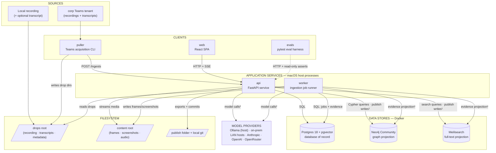
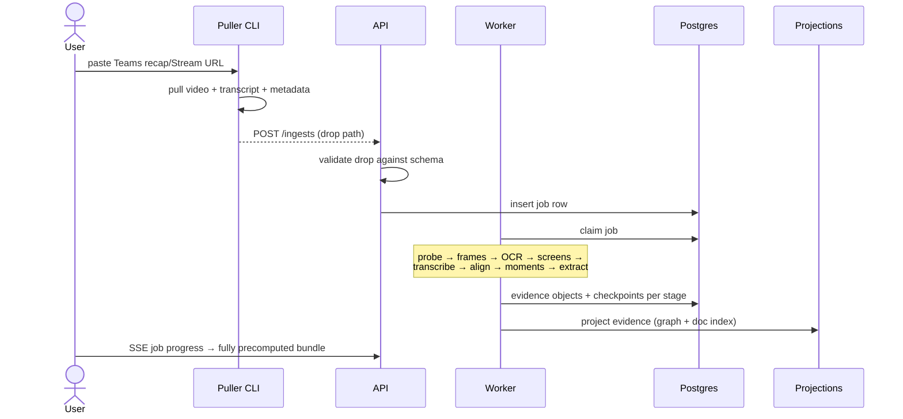
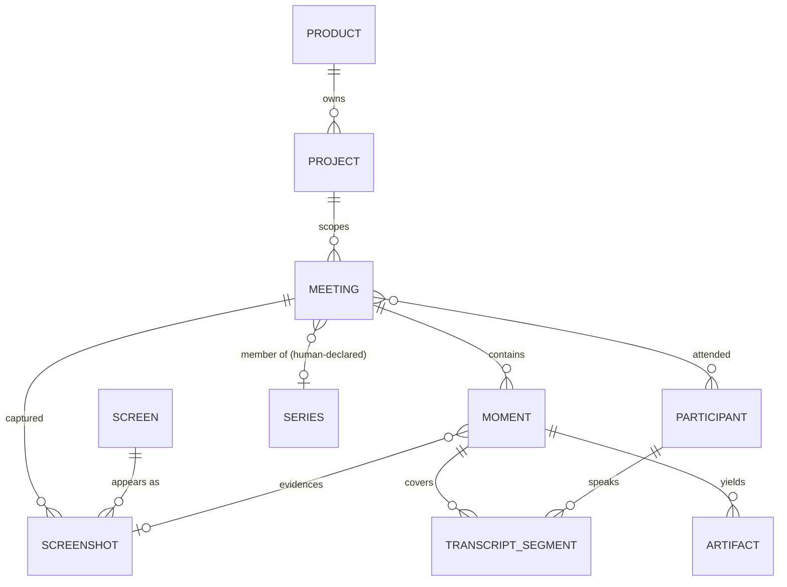
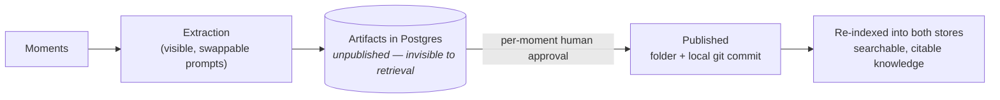
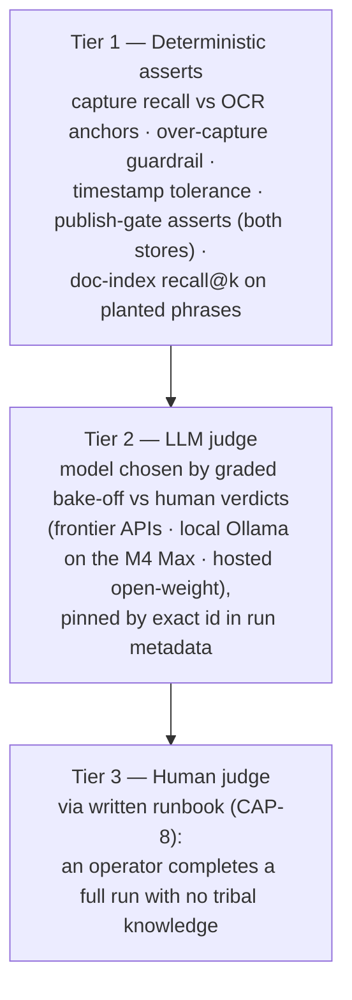

# MeetingMiner — Solution Design

*Prepared for the InfoQ AI Engineering capstone instructors · 2026-08-18*
*Companion to `ARCHITECTURE-SPINE.md` (the build contract) and `SPEC-meetingminer` (the capability contract).*

---

## 1. What MeetingMiner is

Lead application architects mine recorded software demonstrations into requirements, architecture decisions, and backlog changes by hand — scrubbing video, screenshotting, aligning transcripts, pasting evidence into an LLM. Hours per meeting, and it fails silently: a missed screen means nobody knows to look for the requirement it contained.

MeetingMiner treats meetings as **evidence to preserve, not conversations to summarize**. Every artifact it produces — an ADR, an action item, an answer in chat — traces to the exact video moment that produced it. The system's one absolute rule:

> **No citation, no answer.** Every factual claim about meeting content must trace to a moment. No exceptions — and it is enforced by deterministic code, not by prompt instructions.

The capstone slice: ingest scripted Microsoft Teams software demos — hosted on the corp Teams tenant and pulled to a local drop folder — precompute a complete evidence bundle, persist a domain graph, answer questions over two retrieval stores with replayable citations, extract ADRs and action items for human-gated publishing, and evaluate the whole thing against machine-readable ground truth — solo developer, roughly one build week.

## 2. Design stance

Three commitments shape everything below.

**Deterministic core, AI at the edges.** Deterministic code implements evidence capture, transcript alignment, provenance recording, replay, search, and evaluation. Model outputs enter the system through exactly two surfaces: extracted artifacts, which require human approval before publication, and answer prose, which must pass deterministic citation validation before it reaches the user. Evidence records are never written by a model. Every model interaction — speech-to-text, OCR, extraction, chat synthesis, judging — sits behind a config-swappable adapter port.

**One database of record, everything else is a projection.** Postgres holds the domain graph and all artifacts (including unpublished drafts). The graph store and the search engine are derived projections, rebuildable from Postgres alone with one command. If a store is corrupted or mis-migrated, or the embedding model changes — rebuild, don't repair.

**AI proposes, humans approve.** Extracted artifacts start unpublished and are visible only in their moment's context. A per-moment human approval publishes them to a folder, commits ADRs to a local git repo, and — only then — indexes them into the retrieval stores as searchable, citable knowledge. Unapproved AI output can never appear in a search result or a chat answer, because the code path that would index it refuses.

## 3. System overview

<small>¹ All store writes execute inside the shared projection module, which contains the publish gate and the rebuild command. ² All model calls go through adapter ports bound in `config.yaml`.</small>

Why this shape:

- **Infra in Docker, code on the host.** Two committed choices cannot live in a container on macOS: Apple Vision OCR is a macOS framework, and local ML (MLX speech-to-text, Ollama) gets no Metal GPU inside Docker's Linux VM. So the stateful infrastructure is containerized — the part that benefits most — and the Python processes run on the host with full native access. One `make up` starts everything. That split is about *evidence and state* — both storage roots, the database of record, and the projections stay on the laptop. Where a model runs is a separate question, answered by config: an engine may be in-process, a host process, an on-prem LAN service (a CUDA ASR host on the same network is one), or a provider API, and swapping between them is an edit to `config.yaml`.
- **The source-drop seam.** The existing transcript puller (a battle-tested Playwright tool that scrapes Teams Stream pages and survives corporate-tenant permission walls) stays a black box in its original language. Its only contract with the pipeline is the drop directory format, pinned by a versioned JSON Schema. Ingestion never knows where evidence came from; new sources (local files, YouTube later) enter through the same door.
- **Three runtime processes, honest microservice boundaries.** API, worker, and web app are separate processes with disjoint write ownership — but there's no broker, no service mesh, no queue infrastructure. Jobs are Postgres rows; the worker claims and advances them through checkpointed, idempotent stages. For a per-meeting, sequential, restartable pipeline that must call macOS-native APIs, a queue framework adds moving parts without adding capability.

## 4. Ingestion: precompute everything before first view

Stage notes worth an instructor's attention:

- **Screen identity is deterministic.** Every distinct application screen is identified by OCR-text similarity (threshold from the eval design), which also recognizes the *same screen across meetings* — the basis of screen-lineage queries. Image-similarity dedup is explicitly deferred; the system is biased to over-capture (100% capture recall required, bounded by an over-capture guardrail).
- **Provided transcripts are immutable inputs.** A Teams transcript (or user-supplied file) is never edited or replaced. The local speech-to-text lane (mlx-whisper on Metal; parakeet-mlx as a swappable alternative) runs as *verification*: alignment produces new derived transcript rows with provenance to both sources. Idempotent stage reruns overwrite only derived rows — never source material.
- **Speaker attribution comes free from Teams**, so diarization defaults to a no-op adapter; a pyannote implementation is documented for transcript-less local recordings.

A ready-made corpus exists: ~25 real meetings already pulled by the transcript tool (vendor, project, Boomi, corp internal). They are part of the **demo corpus** — ingested, searchable, and visible in the live demo — and serve as pipeline-development material before the scripted corp-tenant mock meetings are recorded. Many are transcript-only (view-only recordings with no downloadable video); the pipeline ingests them without the visual lane — transcript-segmented moments, no screenshots or replay. Only the scripted mocks are eval subjects: the real meetings have no ground-truth manifests.

## 5. The domain graph and two-store retrieval

The **Moment** is the atomic unit of evidence: a screenshot, the transcript section around it, timestamps, and provenance. Its UUID is minted once in Postgres and carried verbatim into every store and every answer — so any citation, wherever it surfaced, resolves back to the database of record and replays its original video.

Retrieval spans two derived stores, queried together:

- **Neo4j (graph projection)** answers structural questions: "show every discussion of this screen over time," and the demo's centerpiece — *"I already explained this to Rowan"* — a participants → meetings → topics → moments traversal. Retrieval is hand-written, parameterized Cypher templates: deterministic, unit-testable, citable. The LLM's only jobs are classifying the question to a template and synthesizing the cited answer. (Auto-extraction graph frameworks were evaluated and rejected — see §8.)
- **Meilisearch (full-text projection)** gives typo-tolerant, faceted, highlighted search over transcripts, OCR text, and published artifacts, with generally available (GA) hybrid keyword+vector ranking. Embeddings are computed by the projection module through the embedder port (local `qwen3-embedding` via Ollama by default; API models swappable at the same 1024 dimensions) — store-native auto-embedders stay off so a rebuild is deterministic.

**The publish loop closes the knowledge cycle:** approved artifacts are re-indexed into both stores, so yesterday's published ADR is tomorrow's search hit — with its own citations back to the moments that produced it.

## 6. The citation gate, concretely

The chat pipeline emits inline markers (`[[moment:<uuid>]]`) during synthesis. Before an answer leaves the API, a deterministic validator resolves every marker against Postgres and converts them into a structured citations array (moment, meeting, time range, screenshot). An answer with unresolvable or missing citations is rejected in code. The web app renders replay links from the structured array; the eval harness asserts against the same array. One wire format, three consumers, no drift.

## 7. Evaluation: deterministic-first, runbook-driven

The eval harness is built **before** the demo script — a sequencing rule from the spec — and runs scripted meetings with YAML ground truth through a tiered judging pyramid:

Implementation is a pytest skeleton — YAML fixtures, tier-1 checks as plain tests, tier-2 as marked tests, a small plugin writing immutable run artifacts to `evals/runs/<run-id>/` with the full resolved config snapshot (models, prompts, thresholds) recorded per run. Any pipeline or judge-model change invalidates prior verdicts and triggers a rerun. The harness interacts with the system only as a client — through the public API for mutations, read-only queries for asserts — so it exercises the same publish gate it verifies.

## 8. Technology selection (web-verified, not recalled)

Every named technology was verified against live sources on 2026-08-17 — versions, maintenance status, and Apple Silicon fit — and the verification itself changed the design:

- **Kuzu**, the natural embedded graph pick, is dead upstream (repo archived after Apple acquired the company, Oct 2025). Excluded.
- **Microsoft GraphRAG** is in maintenance mode and, like LightRAG, is built around LLM auto-extraction — a mismatch for a hand-defined domain schema. Excluded in favor of deterministic traversal templates.
- **arq** (a popular Python job queue) is officially maintenance-only — one more reason the hand-rolled Postgres job runner is the right call, beyond the decisive one already given in §3.
- **Meilisearch** is no longer pure MIT (core MIT + Business Source License (BSL) enterprise components) and its hybrid search is now GA — both facts current, both acceptable here.

| Layer | Choice | Version |
| --- | --- | --- |
| Database of record | Postgres (+ pgvector) | 18 / 0.8.x |
| Graph projection | Neo4j Community (arm64) | 2026.07 |
| Full-text projection | Meilisearch (arm64) | 1.53.x |
| API | FastAPI · Python | 0.141.x · 3.12+ |
| Frontend | Vite · React · shadcn/ui | 8.x · 19.x · CLI v4 |
| Model adapter | LiteLLM (behind project-owned ports) | ≥1.97 |
| Local models | Ollama · mlx-whisper · parakeet-mlx | 0.32.x · 0.4.x · 0.5.x |
| OCR | Apple Vision (PyObjC) · Tesseract fallback | macOS-native |
| Eval harness | pytest | 9.1.x |
| Typed API client | @hey-api/openapi-ts | 0.99.x |

Default model bindings for the demo: extraction and chat synthesis on `claude-sonnet-5` (cloud primary), local Ollama models as the configured fallback — and a live "swap the model in config" demo beat. The judge model is selected and pinned as described in §7.

## 9. Scope honesty

Designed everything; building the slice. **Built in this capstone:** evidence core, domain graph, two-store retrieval with cited Q&A, moment view/replay, ADR + action-item extraction, human-gated publishing to folder + local git, the full eval harness and runbook. **Designed and documented only:** retrieval eval implementation, autonomous ingestion, digest delivery, outbound routing to live trackers (Asana/Linear/GitHub/SharePoint), auth (Clerk/Entra), per-participant prompt packs. The one-way rule holds throughout: MeetingMiner may display items it created elsewhere, but external trackers own their lifecycle — MeetingMiner is the evidence at the origin of the decision workflow, not another status silo.

## 10. Where the contracts live

- `ARCHITECTURE-SPINE.md` — the 16 architecture decisions (AD-1…AD-16), consistency conventions, and deferred list that keep independently built pieces compatible. The build substrate.
- `SPEC-meetingminer` (`SPEC.md` + companions) — capabilities CAP-1…CAP-9, constraints, eval strategy and design, UX spine, scope.
- The run's `.memlog.md` — every decision with its rationale, including the research findings above.
